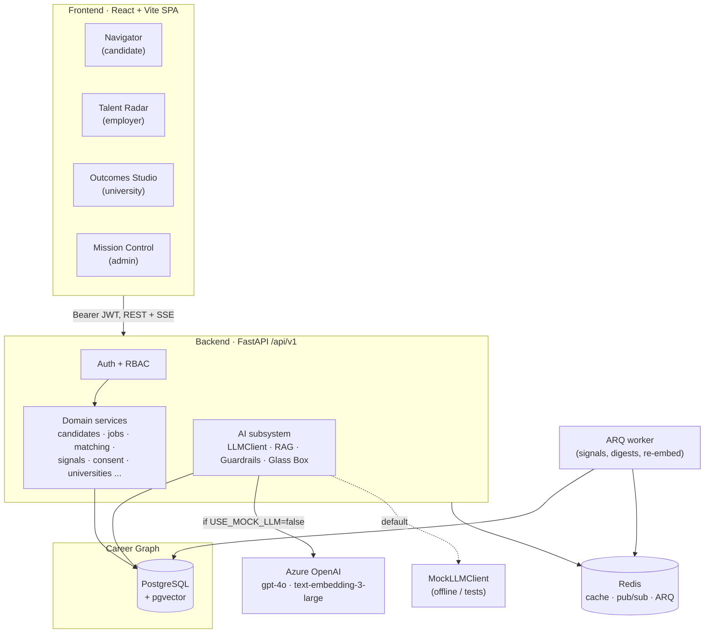

# Atlas — Asia's Career OS

> **A map, not a fortune-teller. One Career Graph. Three control rooms.**

Atlas is a longitudinal career operating system for Asia. Job boards see jobs, ATS sees
filters, universities see graduation — **nobody sees a career as one continuous thing.**
Atlas does. It builds **one portable, candidate-owned Career Graph** of a person's skills,
achievements, roles, and trajectory across a 40-year arc, and turns it into three coherent
control rooms — for candidates, employers, and universities — plus an admin mission control.

Built for the **Talentbank Tech Hackathon (First Cohort)**.

---

## The thesis

Atlas rests on five commitments. They are the product, not decoration.

1. **One Career Graph.** Every module is a *lens on one shared graph*, never a bolted-on
   feature. Talentbank's universities + employers in a single graph is a moat incumbents
   cannot structurally copy — they each own only one or two sides.
2. **Three control rooms.** **Navigator** (candidate), **Talent Radar** (employer), and
   **Outcomes Studio** (university) all read and write the same graph, governed by consent.
3. **Glass Box, never black box.** Every AI output ships with a plain-language **rationale +
   evidence citations + a confidence band + "what would change this."** No naked scores.
4. **Ranges, not answers.** We surface the realistic *spread* of outcomes for "people of
   similar shape" with explicit trade-offs. The user always chooses — navigation, not prediction.
5. **Data dignity.** The candidate owns the graph. Granular, time-boxed, revocable consent
   governs who sees what. PDPA (Malaysia) / GDPR-native, with full export and erasure.

---

## Feature highlights by audience

### Candidate · Navigator
- **Trajectory Atlas** — interactive constellation of realistic next moves; each route shows a
  salary range, time-to-reach band, feasibility, skill gap, and trade-offs.
- **Career Copilot** — streaming AI coach that reasons over *your* graph + market data, cites
  sources, and shows uncertainty.
- **Fair Pay Engine** — market range (P25/P50/P75) for your role/region/experience, plus a
  negotiation script and timing.
- **Career Weather** — plain-language local market briefing: demand, rising/cooling skills,
  salary drift.
- **Pivot Feasibility** — "to move X→Y, here's the gap and a realistic ramp," with ranges.
- Profile builder + **LLM résumé parsing**, hybrid semantic + keyword job search,
  application tracker, and an explainable per-job match score.

### Employer · Talent Radar
- **Smart Talent Matching** — trajectory-aware, two-sided, fully explainable candidate matches.
- **Bias & Fairness Auditor** — de-bias job-description language before posting.
- **Retention Signals** — consented quiet signals (activity drop, peers leaving) → a manager
  nudge while there's still time.
- Pipeline CRM, onboarding-risk flags, warm-bench re-engagement, and a UN-WPP-based
  **Workforce Resilience Planner**.

### University · Outcomes Studio
- **Lifelong Outcome Loop** — graduate outcome tracking from first-destination onward.
- **Adaptive Readiness Profile** — a live employability signal that grows with each student.
- **Future-State Curriculum Engine** — live postings + skill trends → forward-projected
  curriculum gaps for faculty.
- Internship marketplace and a credential wallet (issue/verify).

### Admin · Mission Control
- Tenant & user management, taxonomy, **AI usage & cost ledger**, and an audit-log explorer.

---

## Architecture summary

Atlas is a FastAPI + React monorepo over **one Postgres + pgvector Career Graph**, with a
**swappable LLM** behind a `LLMClient` Protocol (Azure OpenAI in prod, a deterministic mock
offline/in tests).



- **Frontend** — React 18 + Vite + TypeScript SPA; four role-scoped workspaces sharing one
  component library; TanStack Query, React Router, Zustand, Tailwind + shadcn/ui, Recharts.
- **Backend** — FastAPI, domain-based modules (`router · service · repository · schemas ·
  models · deps`), async SQLAlchemy 2.0, served by uvicorn.
- **Database** — PostgreSQL + pgvector (Neon in prod); the Career Graph spine.
- **AI** — Azure OpenAI behind the `LLMClient` Protocol; structured outputs, RAG, guardrails.
- **Jobs / realtime** — ARQ + Redis for background work; SSE for LLM streaming.

See [`docs/architecture/overview.md`](docs/architecture/overview.md) and the
[API contract](docs/architecture/api-contract.md).

---

## Tech stack

| Layer | Choices |
|---|---|
| **Backend** | Python 3.12, FastAPI, async SQLAlchemy 2.0, Pydantic v2 + pydantic-settings, Alembic, asyncpg, pgvector, ARQ, Redis, Argon2 (argon2-cffi), PyJWT, tenacity, structlog, slowapi, openai SDK (Azure) |
| **Frontend** | React 18, Vite, TypeScript, TanStack Query, React Router, Zustand, Tailwind, shadcn/ui (Radix), react-hook-form, zod, Recharts |
| **Testing** | pytest + pytest-asyncio + httpx (backend, LLM mocked), Vitest + Testing Library (frontend) |
| **Infra** | Docker, Docker Compose, GitHub Actions (ruff/mypy/pytest · eslint/tsc/vitest), Vercel + Render + Neon |
| **Open data** | O*NET, ESCO, Lightcast Open Skills (taxonomy), OpenDOSM wages, UN World Population Prospects 2024, W3C VC / Open Badges 3.0 |

---

## Quickstart

### Option A — Docker Compose (recommended)

From the **repo root**:

```bash
docker compose up
```

This starts Postgres (pgvector), Redis, the API, the ARQ worker, and the frontend.

- **Frontend** → http://localhost:5173
- **API + interactive docs** → http://localhost:8000/docs (health at `/health`)

> **Honest note:** the compose `api` command runs `init_db` then `seed --if-empty`, and the
> `worker` service runs the ARQ settings module. The `app.scripts.seed` and
> `app.workers.arq_settings` modules are **scaffolded targets in the build plan and not yet
> committed** (see the maturity matrix). Until they land, start the infra and run the API on
> the host with local dev (Option B), or comment out the `seed` step / `worker` service.

### Option B — Local dev

**Backend** (Python 3.12):

```bash
# 1. Bring up just the infra
docker compose up db redis

# 2. Backend
cd backend
python -m venv .venv && source .venv/bin/activate
pip install ".[dev]"
cp .env.example .env                  # defaults work out of the box (mock LLM)
python -m app.scripts.init_db         # creates schema + enables pgvector
python -m app.scripts.seed            # loads taxonomy + demo accounts + sample data
uvicorn app.main:app --reload         # → http://localhost:8000/docs
```

**Frontend**:

```bash
cd frontend
npm install
npm run dev                            # → http://localhost:5173
```

---

## Demo accounts

After seeding, sign in with any of these (the login screen has one-click "use this account"
buttons for each). **Password for all four: `demo1234`.**

| Persona | Email | Lands in |
|---|---|---|
| Aisyah — final-year CS student | `aisyah@demo.atlas` | Navigator |
| Daniel — recruiter | `daniel@demo.atlas` | Talent Radar |
| Dr. Tan — career-services lead | `dr.tan@demo.atlas` | Outcomes Studio |
| Platform Admin | `admin@demo.atlas` | Mission Control |

A guided 5-minute click-through is in [`docs/DEMO.md`](docs/DEMO.md).

---

## Azure OpenAI setup

Atlas runs **fully offline by default** on a deterministic `MockLLMClient` — no keys required,
so every AI surface works in the demo and in CI. To use the real model, set `USE_MOCK_LLM=false`
**and** provide the four Azure variables (the client only goes live when both are true):

```bash
USE_MOCK_LLM=false
AZURE_OPENAI_ENDPOINT=https://<your-resource>.openai.azure.com/
AZURE_OPENAI_API_KEY=<key>
AZURE_OPENAI_DEPLOYMENT=gpt-4o                          # gpt-4o-class chat deployment
AZURE_OPENAI_EMBEDDING_DEPLOYMENT=text-embedding-3-large
# optional, sensible defaults shown:
AZURE_OPENAI_API_VERSION=2024-10-21
EMBEDDING_DIMENSIONS=1536                               # trimmed for storage
```

If `USE_MOCK_LLM=false` but credentials are absent, Atlas logs a warning and **falls back to
the mock** rather than crashing.

---

## Feature maturity matrix

We tier honestly — honesty is scored.

- **Tier A** — production-deep, end-to-end, demoable.
- **Tier B** — functional, lighter, honestly labeled.
- **Tier C** — designed + scaffolded (API/stub/UI shell) with clear extension points.

| Feature | Audience | Tier | Status |
|---|---|---|---|
| Email/password auth, JWT access + refresh, Argon2id, RBAC (6 roles) | Cross-cutting | A | Implemented |
| Org/tenant model with `org_id` scoping; per-object authz (BOLA defense) | Cross-cutting | A | Implemented |
| Consent & Data Dignity Center (granular, time-boxed, revocable) | Cross-cutting | A | Implemented (enforced at repository layer) |
| Audit log (append-only) for career-data access | Cross-cutting | A | Implemented |
| Data export + account erasure (RTBF) | Cross-cutting | A | Implemented |
| Glass Box explainability component (rationale + citations + confidence + what-would-change) | Cross-cutting | A | Implemented, reused across all AI surfaces |
| AI provenance manifest in docs + UI | Cross-cutting | A | Implemented (docs); see `docs/ai-provenance.md` |
| Rate limiting (auth/AI tighter), CORS allowlist, request-id, structured logs | Cross-cutting | A | Implemented |
| Postgres Row-Level Security backstop on sensitive tables | Cross-cutting | C | Designed; consent/authz enforced in app layer today, RLS not yet applied |
| i18n scaffolding (EN / Malay / 中文), dark/light theme, responsive, a11y | Cross-cutting | B | Scaffolded |
| Career Graph schema + taxonomy (O\*NET/ESCO/Lightcast IDs, ISCO→MASCO) | Graph | A | Implemented (schema + seed pipeline) |
| Job-to-job transition graph; skill proficiency + evidence; pgvector embeddings | Graph | A | Implemented |
| Skill Half-Life / decay tracking | Graph | B | Designed + partial |
| "People like you" cohort engine | Graph | B | Designed + partial |
| Profile builder + completeness meter | Candidate | A | Implemented |
| LLM résumé parsing → structured graph (Glass Box per inference) | Candidate | A | Implemented |
| Hybrid semantic + keyword job search (pgvector + BM25 + RRF) | Candidate | A | Implemented |
| Application tracker + status timeline | Candidate | A | Implemented |
| Trajectory-aware match score with Glass Box | Candidate | A | Implemented |
| **Trajectory Atlas** (Career Path Navigator) | Candidate | A | Implemented |
| **Career Copilot** (AI coach, SSE streaming, tool-use) | Candidate | A | Implemented |
| **Fair Pay Engine** (P25/P50/P75 + negotiation) | Candidate | A | Implemented |
| **Career Weather** | Candidate | A | Implemented |
| **Pivot Feasibility + ramp** | Candidate | A | Implemented |
| Living Portfolio · Life Chapter Designer · cover letters · interview prep | Candidate | B | Functional, lighter |
| Learning Wallet (holder side) · public profile · scheduling | Candidate | C | UI shell + designed API |
| Employer onboarding + team management; job CRUD + lifecycle | Employer | A | Implemented |
| **Bias & Fairness Auditor** (de-bias JD) | Employer | A | Implemented |
| Pipeline / funnel CRM; employer dashboard | Employer | A | Implemented |
| **Smart Talent Matching** (trajectory-aware, consent-gated, explainable) | Employer | A | Implemented |
| **Retention Signals** · Re-Engagement · Onboarding Predictor · Hidden-Talent | Employer | B | Functional, lighter |
| **Workforce Resilience Planner** (UN-WPP scenarios) | Employer | C | Designed + UI shell |
| University org + cohort/program model; student roster | University | A | Implemented |
| **Adaptive Readiness Profile** | University | A | Implemented |
| **Lifelong Outcome Loop** + outcomes analytics | University | A | Implemented |
| **Future-State Curriculum Engine** · Internship Marketplace | University | B | Functional, lighter |
| Lifelong Learning Wallet (issuer/verifier, Open Badges 3.0) | University | C | Designed + UI shell |
| Mission Control: tenants, users, taxonomy, AI usage/cost, audit explorer | Admin | A | Implemented (taxonomy mgmt Tier B) |
| `LLMClient` Protocol → AzureOpenAIClient (swappable) + Mock | AI craft | A | Implemented |
| Structured outputs `{rationale, citations[], confidence}`; SSE streaming | AI craft | A | Implemented |
| Tool/function calling; RAG (hybrid + RRF); prompt-injection delimiting; PII redaction | AI craft | A | Implemented |
| Tenacity retries/timeouts; `llm_usage` cost ledger; token caps; caching | AI craft | A/B | Ledger + retries implemented; caching partial |
| ARQ background jobs (signals, digests, re-embedding) + worker | Cross-cutting | C | Designed; `arq_settings`/tasks not yet committed |
| WebSocket live notifications (`/ws/notifications`) | Cross-cutting | C | In API contract; REST notifications implemented, WS not yet |
| Alembic migrations | Cross-cutting | B | Env wired; `init_db` is the demo path, version scripts pending |

---

## Testing

```bash
# Backend (LLM is always mocked in tests — never calls Azure)
cd backend
pytest --cov=app

# Frontend
cd frontend
npm run test
```

CI (`.github/workflows/ci.yml`) runs **ruff + ruff format + mypy + pytest** (backend, against a
real pgvector Postgres + Redis service, `USE_MOCK_LLM=true`) and **eslint + tsc + vitest +
build** (frontend) on every push and PR.

---

## Security & privacy

- **RBAC** across six roles with **per-object authorization (BOLA defense)** on every fetch.
- **Consent enforcement at the repository layer** — employer/university reads of a candidate
  filter by an active, unexpired `ConsentGrant`.
- **Append-only audit log** for all sensitive access; an access-log endpoint shows the
  candidate *who viewed what*.
- **Data export + erasure** (PDPA Malaysia / GDPR: explicit, granular, revocable consent; data
  minimization; encryption at rest via Neon).
- Short-lived JWT access tokens + rotating refresh tokens, **Argon2id** hashing, rate limiting,
  CORS allowlist, request-id propagation, secrets via env.
- **Postgres RLS** is designed as a backstop on sensitive tables; today the equivalent
  guarantees are enforced in the application/repository layer (see the maturity matrix).

---

## AI provenance summary

- **Models:** Azure OpenAI **gpt-4o-class** chat + **text-embedding-3-large**, behind a
  swappable `LLMClient` Protocol. A deterministic **MockLLMClient** powers offline demos and CI.
- **In-product AI:** résumé parsing, match explanations, Career Copilot, Trajectory Atlas, Fair
  Pay, Career Weather, Pivot, readiness, curriculum, bias auditor, workforce scenarios.
- **Discipline:** structured outputs with a **Glass Box** (rationale + citations + confidence +
  what-would-change), RAG grounding, **ranges not answers**, prompt-injection delimiting, PII
  redaction before logging, a refuse-to-fabricate guardrail, and a per-org cost ledger.
- **Build tool:** authored with **Claude Code**.

Full declaration: [`docs/ai-provenance.md`](docs/ai-provenance.md).

---

## Repository layout

```
.
├── backend/                 # FastAPI service
│   ├── app/
│   │   ├── main.py          # app factory: middleware, rate limit, /health, router mount
│   │   ├── core/            # config, security, db, deps, logging, exceptions, roles
│   │   ├── db/              # declarative base + model registry
│   │   ├── api/v1/router.py # aggregates domain routers under /api/v1
│   │   ├── domains/         # auth, candidates, employers, universities, jobs,
│   │   │                    #   applications, matching, signals, consent, credentials,
│   │   │                    #   notifications, admin, taxonomy, organizations, ai
│   │   ├── workers/         # ARQ worker (tasks)
│   │   └── scripts/         # init_db (+ seed, planned)
│   ├── alembic/             # migration env
│   ├── tests/               # pytest (LLM mocked)
│   └── Dockerfile
├── frontend/                # React + Vite SPA
│   └── src/
│       ├── app/             # router, providers, layout shells, role nav
│       ├── features/        # candidate, employer, university, admin, auth, marketing
│       ├── components/ui/   # shadcn primitives
│       └── lib/ hooks/ stores/ types/
├── docs/
│   ├── architecture/        # overview.md, api-contract.md
│   ├── ai-provenance.md
│   ├── DEMO.md
│   ├── intent-form-brief.md
│   └── superpowers/specs/   # design spec
├── docker-compose.yml
├── render.yaml              # Render blueprint (API + worker + Redis)
└── .github/workflows/ci.yml
```

---

## Code ownership & licence

Per the **Talentbank Tech Hackathon** terms & conditions, **the team retains full ownership of
this code**. It is the team's original work for the hackathon. AI assistance and the AI models
used in-product are declared in [`docs/ai-provenance.md`](docs/ai-provenance.md). No licence is
granted beyond what the hackathon terms require; contact the team for any reuse.
