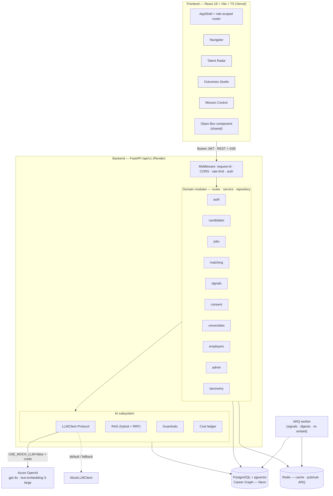

# Atlas — System Architecture Overview

**Atlas is one Career Graph with many lenses.** A FastAPI backend, a React SPA, one
PostgreSQL + pgvector database, and a swappable LLM. This document explains how the pieces fit,
how a request flows, and what is built versus designed. For the exact HTTP surface see
[`api-contract.md`](./api-contract.md); for the product rationale see the design spec under
`docs/superpowers/specs/`.

---

## 1. Component diagram

---

## 2. Request & data flow

A typical authenticated, AI-backed request (e.g. **Trajectory Atlas**):

1. **Frontend** holds a short-lived JWT access token (rotating refresh token in the background).
   TanStack Query issues `POST /api/v1/ai/atlas` with `Authorization: Bearer …`.
2. **Middleware** stamps a request-id, applies CORS + rate limits (AI endpoints are throttled
   tighter than default).
3. **Auth dependency** resolves the principal (user + roles + org) from the token.
4. **Router** (thin) hands off to the **service**, which holds the logic.
5. The service uses the **repository** to read the candidate's slice of the Career Graph from
   Postgres — and, for cross-person reads, the repository filters by active **consent grants**.
6. The service builds a grounded prompt: **RAG** retrieves relevant chunks (hybrid pgvector +
   keyword, fused with RRF); untrusted text is fenced by the **guardrails**.
7. The **LLMClient** (Azure or mock) returns a **structured** result validated into a Pydantic
   model carrying `rationale`, `citations[]`, and `confidence`.
8. Token usage is recorded in the **cost ledger**; the structured response is returned and the
   SPA renders it through the shared **Glass Box** component.

Streaming chat (`/ai/coach/stream`) follows the same path but returns **Server-Sent Events**
(`data: {"delta": "…"}` … `data: [DONE]`).

**Layering rule (backend):** routers are thin; services own logic; repositories own all DB
queries; the commit happens at the service boundary. Each domain folder is
`router · service · repository · schemas · models · deps`.

---

## 3. Domain map

Routers are aggregated under `/api/v1` by `app/api/v1/router.py`. Domains:

| Domain | Responsibility |
|---|---|
| `auth` | Register/login/refresh/logout, JWT, Argon2id, role assignment |
| `candidates` | Profile, career events, skills, résumé parse, dashboard, consent-gated reads |
| `employers` | Org onboarding, dashboards, onboarding-risk, re-engagement, workforce scenarios |
| `universities` | Cohorts, roster, readiness, outcome loop, curriculum, internships |
| `jobs` | Job CRUD + lifecycle, hybrid search, per-job match, debias (Bias Auditor) |
| `applications` | Apply, pipeline, status timeline + events |
| `matching` | Trajectory-aware two-sided matching (candidate↔job), explainable |
| `signals` | Retention / onboarding / plateau / underpaid signals with evidence |
| `consent` | Grant/revoke, scopes, access log, export, erasure |
| `credentials` | Issue/verify (Open Badges 3.0 path — designed) |
| `notifications` | In-app notifications (REST; WebSocket live push is designed) |
| `admin` | Tenants, users, taxonomy, AI usage/cost, audit explorer |
| `taxonomy` | Skills / occupations / crosswalks lookups |
| `organizations` | Tenant model shared by employers + universities |
| `ai` | The AI feature endpoints + the LLM/RAG/guardrails subsystem |

`users` currently provides the shared user model; its endpoints surface via `auth`/`admin`.

---

## 4. Career Graph data model (summary)

The Career Graph is the spine — every lens reads and writes it. Core entities:

- **Identity & tenancy:** `User`, `Organization` (employer|university), `Membership` (user↔org↔role).
- **The person:** `CandidateProfile`, `CareerEvent` (role|education|project|break|credential),
  `CandidateSkill` (proficiency + evidence: asserted|verified|inferred).
- **The taxonomy:** `Skill` (with O\*NET/ESCO/Lightcast IDs), `Occupation` (ISCO→MASCO→SOC),
  `OccupationSkill` (importance/level/essential), `OccupationTransition` (weight, median months,
  salary delta) — the job-to-job transition graph behind Trajectory Atlas.
- **Opportunity:** `Job` (with `embedding`), `Application` (status timeline, feedback),
  `MatchResult` (cached, explainable: score + rationale + citations + confidence).
- **Trust & governance:** `ConsentGrant` (scoped, time-boxed, revocable), `AuditLog`
  (append-only), `LlmUsage` (per-org cost ledger).
- **Signals & outcomes:** `Signal`, `Cohort`, `Outcome`, `Credential`.
- **Semantic layer:** `Embedding` (owner_type, owner_id, model_version, vector, chunk) — at
  minimum candidate career text + job descriptions, plus a market corpus for RAG.

Two embedding-bearing corpora (candidate text, job descriptions) feed both search and matching;
embeddings are versioned by model so re-embedding on model upgrade is tracked.

---

## 5. AI subsystem

- **Abstraction.** A single `LLMClient` Protocol (`chat`, `stream_chat`, `structured`, `embed`)
  → `AzureOpenAIClient` (official `openai` SDK, `AsyncAzureOpenAI`) or `MockLLMClient`. Selected
  by a factory that prefers Azure only when live mode is enabled *and* configured.
- **Structured everything.** AI verdicts decode into Pydantic schemas carrying
  `{rationale, citations[], confidence}` — rendered by the shared Glass Box component.
- **RAG.** Structure-aware chunking; embed with `text-embedding-3-large` (dimensions trimmed);
  HNSW vector search + keyword; fuse with Reciprocal Rank Fusion; optional rerank.
- **Guardrails.** Untrusted content delimiting (prompt-injection defense), PII redaction before
  logging, refuse-to-fabricate, ground-every-claim, surface-uncertainty.
- **Reliability & cost.** Tenacity retries/timeouts honoring `Retry-After`, per-request token
  caps, the `llm_usage` ledger, and embedding/completion caching.

See [`../ai-provenance.md`](../ai-provenance.md) for the full declaration.

---

## 6. Background jobs

ARQ workers (on Redis) are designed to run the asynchronous, non-request-path work: detecting
**retention/plateau/underpaid signals**, sending **email digests**, **re-embedding** content on
change or model upgrade, and pushing notifications. The worker runs the **same Docker image** as
the API with a different start command (`arq app.workers.arq_settings.WorkerSettings`).

> **Status:** the worker service is wired in `docker-compose.yml` and `render.yaml`; the
> `app.workers.arq_settings` module and task implementations are scaffolded in the build plan
> and not yet committed (Tier C in the README matrix).

---

## 7. Realtime

- **SSE** powers Career Copilot streaming today (`POST /ai/coach/stream`), returning content
  deltas the SPA renders token-by-token.
- **WebSockets** + Redis pub/sub are specified for live notifications and dashboards
  (`WS /ws/notifications`). The REST notifications API is implemented; the WebSocket push is
  designed and not yet wired (Tier C).

---

## 8. Deployment

| Tier | Platform | Notes |
|---|---|---|
| **Frontend** | **Vercel** | Vite SPA, preview deploys per PR; `VITE_API_BASE_URL` points at the API. |
| **Database** | **Neon** | PostgreSQL with pgvector enabled, branchable; `DATABASE_URL` uses the async driver. |
| **Backend** | **Render** | Dockerized FastAPI web service + a separate ARQ worker from the same image, plus a managed Redis add-on. Public HTTPS for the demo URL. See `render.yaml`. |

**Local dev** uses Docker Compose (Postgres + Redis + API + worker + frontend) from the repo
root; `init_db` provisions the schema and enables pgvector, Alembic is the production migration
path. Fly.io is documented as a backend alternative.

CI (`.github/workflows/ci.yml`) gates every push/PR with ruff + ruff format + mypy + pytest
(backend, real pgvector service, mocked LLM) and eslint + tsc + vitest + build (frontend).
